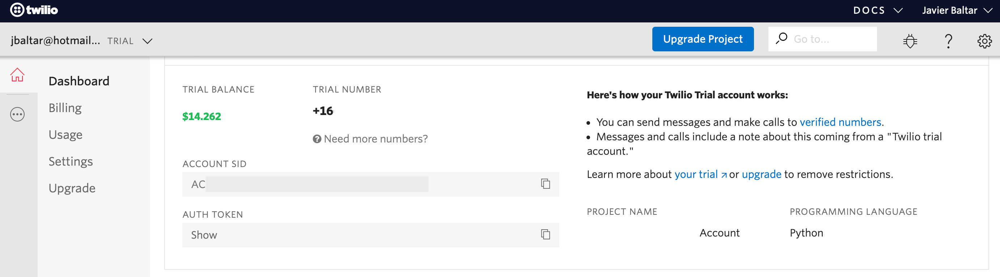
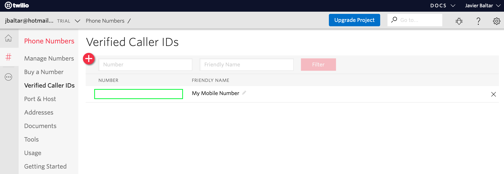
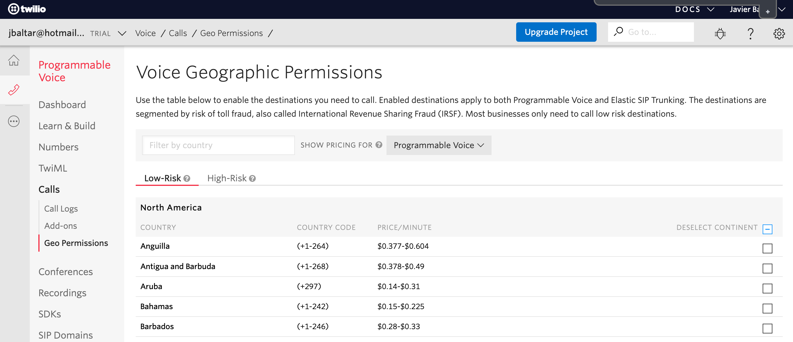

# twilio-workshop
<p align="center">
  <a href="#Getting-Started">Getting Started</a> •
  <a href="#Tower-CLI">Tower CLI</a> •
  <a href="#API">API</a> •
  <a href="#Notifications">Notifications</a> •
  <a href="#Docker-Security">Docker Security</a> •
  <a href="#related">Related</a> •
  <a href="#Authors">Authors</a>
</p>

## Getting Started
To run an Ansible Playbook with AWX, you need to configure the following items
- Credentials: User name/password or ssh key to connect to remote component
```pip install twilio```

- Twilio account details


- Geo Restrictions




- Announcement
```xml
<?xml version="1.0" encoding="UTF-8"?>
<Response>
    <Say voice="woman" language="es-ES">Esta es una llamada de prueba!</Say>
</Response>
```


## Code

```python
from twilio.rest import Client

#Set From and To numbers variables
From_Number = "+16692015XXX"
To_Number = "+34XXXXXXXXX"

#Set announcement xml resource
Src_Path = "http://demo.twilio.com/docs/voice.xml"

#Set Account SID, AUTH TOKEN parameters
account_sid = 'ACXXXXXXXXXXXXXX'
auth_token = 'your_auth_token'
client = Client("account_sid","auth_token")

#Call triggering
call = client.calls.create(to=To_Number, from_=From_Number, url = Src_Path, method = 'GET')
print('Call triggered successfully')

#Print call sid and status
print(call.sid, call.status)
```
  


## Related
* [Twilio Programmable Voice Docs](https://www.twilio.com/docs/voice) - Twilio API documentation
 
## Authors
* **Javier Baltar** - *Initial work* - [GitHub](https://github.com/JavierBaltar)

